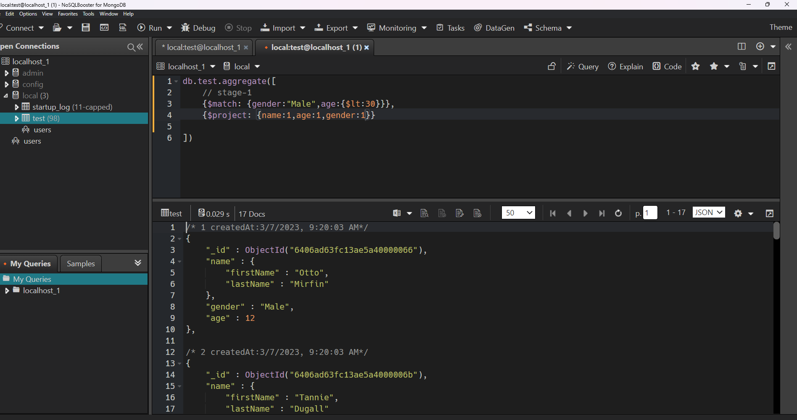

Practice Data: https://github.com/Apollo-Level2-Web-Dev/mongodb-practice 


In This Module, You'll Be Introduced To The Robust Aggregation Framework In MongoDB. Gain An Understanding Of How This Framework Empowers Advanced Data Processing And Manipulation, Providing A Flexible And Efficient Approach To Data Analysis Within MongoDB.


What Will You Learn From This Module?


0) Introduction of a powerful aggregation framework: Dive into the world of data manipulation with the powerful Aggregation Framework. We'll explore how it allows you to process, group, and summarize data from your MongoDB collections.


1) $match , $project aggregation stage: Dive into the $match and $project aggregation stages. Learn how $match filters documents based on specified criteria, while $project enables reshaping by including or excluding fields.


2) $addFields , $out , $merge aggregation stage:Explore the $addFields, $out, and $merge aggregation stages. Understand how to add new fields, write results to a new collection overwrite an existing one, and merge results into an existing collection.


3) $group , $sum , $push aggregation stage: Delve into the $group aggregation stage, allowing grouping by a specified key. Learn to use $sum to calculate the sum within a group and $push to create arrays of values.


4) explore more about $group & $project: Further, explore the capabilities of $group and $project aggregation stages. Understand advanced techniques in grouping and reshaping data for specific analysis requirements.


5) Explore $group with $unwind aggregation stage: Discover the $group aggregation stage combined with $unwind. Learn how to handle arrays within documents, facilitating more complex aggregations.


6) $bucket, $sort, and $limit aggregation stage: Explore the $bucket aggregation stage for categorizing data, $sort for sorting results, and $limit for limiting document output.


7) $facet, multiple pipeline aggregation stage: Dive into the $facet aggregation stage, enabling the execution of multiple pipelines within a single stage. Understand how this feature facilitates parallel processing of various aggregations.


8) $lookup stage, embedding vs referencing: Explore the $lookup aggregation stage for performing left outer joins between collections. Understand the concepts of embedding and referencing for efficient data modeling.


9) What is indexing, COLLSCAN vs IXSCAN: Learn about indexing in MongoDB, its importance in optimizing query performance, and the distinction between COLLSCAN (Collection Scan) and IXSCAN (Index Scan).


10) Explore compound index and text index: Delve into compound indexes, involving multiple fields, and text indexes designed for efficient text searching. Understand how these indexes enhance query efficiency.


Embark on this journey to master MongoDB Aggregation and enhance your data manipulation and analysis skills within the MongoDB environment! Happy learning!

## 16-0 Intro the powerful aggregation framework


## 16-1 $match , $project aggregation stage
- aggrigation stage-1


```sql
db.test.aggregate([
 
    // stage-1
    {$match: {gender:"Male",age:{$lt:30}}},
    // stage-2
       {$project: {name:1,age:1,gender:1}},
   
])
```
## 16-2 $addFields , $out , $merge aggregation stage
- original data not modified


```sql
db.test.aggregate([
  // stage-1
  { $match: { gender: "Male", age: { $gt: 30 } } },
  // Stage-2
  {
    $addFields: {
      course: "Level-2",
      eduTech: "Programming Hero",
      monerMoto: "Moner Iccha",
    },
  },
  // stage-3
  //   { $project: { course: 1, eduTech: 1 } },

  // stage-4

  { $out: "Course-Students"},
]);
```

- if you want create extra collection in specific collection and  $out and if you want create existing data in main data use $merge


## 16-3 $group , $sum , $push aggregation stage


- show all data 
```sql
db.test.aggregate([
    { $group: { _id: "$address.country", count: { $sum: 1 } ,showName:{$push: "$$ROOT" }}}
    
])
```


```sql
db.test.aggregate([
    // stage-1
    { $group: { _id: "$address.country", count: { $sum: 1 } ,fullDoc:{$push: "$$ROOT" }}},
    // stage-2
    
    {$project: {
        "fullDoc.name":1,
        "fullDoc.email":1,
        "fullDoc.phone":1,
    }}
])
```

## 16-4 explore more about $group & $project
- name change in project show time
```sql
db.test.aggregate([
    {$group: { _id: null,
        totalSalary:{$sum:"$salary"},
        maxSalary:{$max:"$salary"},
        minSalary:{$min:"$salary"},
        avgSalary:{$avg: "$salary"},
    }},
    // stage-2
    {
        $project: {
          totalSalary:1,
           maxSalary:1,
           
           averageSalary:"$avgSalary"
        }
    }
    ])

    


- calculation in project 
sql
db.test.aggregate([
    {$group: { _id: null,
        totalSalary:{$sum:"$salary"},
        maxSalary:{$max:"$salary"},
        minSalary:{$min:"$salary"},
        avgSalary:{$avg: "$salary"},
    }},
    // stage-2
    {
        $project: {
          totalSalary:1,
           maxSalary:1,
           averageSalary:"$avgSalary",
           rangeBetweenMaxAndMin:{$subtract: ["$maxSalary","$minSalary"]}
        }
    }
    ])
 ``` 
    

## 16-5 Explore $group with $unwind aggregation stage
```js
db.test.aggregate([
  { $unwind: "$friends" },
  {
    $group: { _id: "$friends", count: { $sum: 1 } }
  }
])

// find per age interests
db.test.aggregate([
    //stage-1
    {
        $unwind: "$interests"
    },
    {
        $group: { _id: "$age",interestPerAge:{$push:"$interests"
        }}
    }
    ])
    
```


## 16-6 $bucket, $sort, and $limit aggregation stage

```js
db.test.aggregate([
    {
        $bucket: {
              groupBy: "$age",
              boundaries: [ 20,40, 80 ],
              default: "80 er upore",
              output: {
                "count": { $sum: 1 },
                kakaAse:{$push: "$name"
              }
            }
    }}
    
    ])
 ```

```js
db.test.aggregate([
    // stage-1
    {
        $bucket: {
              groupBy: "$age",
              boundaries: [ 20,40, 80 ],
              default: "80 er upore",
              output: {
                count: { $sum: 1 },
                kakaAse:{$push: "$$ROOT"
              }
            }
    }},
    // stage-2
    {
        $sort: {count:-1}
    },
    //satge-3
    {
        $limit: 2
    },
    //stage-4
    {
        $project: {count:1}
    }
    ])
 ```


## 16-7 $facet, multiple pipeline aggregation stage

```js
db.test.aggregate([
    
    {
        $facet: {
            //pipeline-1
            "friendsCount":[
                // stage-1
                {$unwind: "$friends"},
                // stage-2
                {$group: { _id: "$friends",count:{$sum: 1}}}
                ],
                //pipeline-2
               "educationCount":[
                 //stage-1
                 {$unwind: "$education"},
                 //stage-2
                 {$group: { _id: "$education",count:{$sum:1}}}
                   
                   ] ,
                   //pipeline-3
                   "skillsCount":[
                       {$unwind: "$skills"},
                       {$group: { _id: "$skills",count:{$sum:1}}}
                       
                       ]
        }
    }
    ])
 ```
 
    